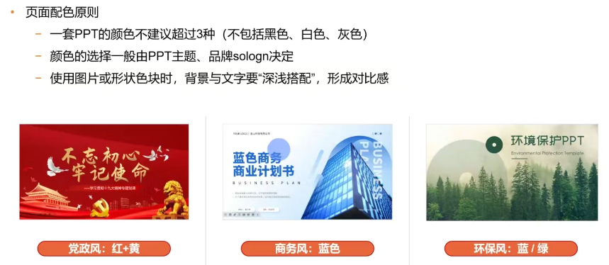
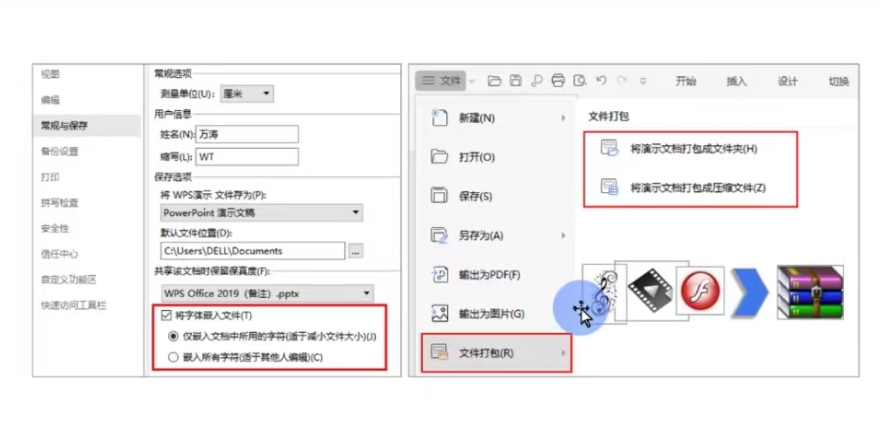
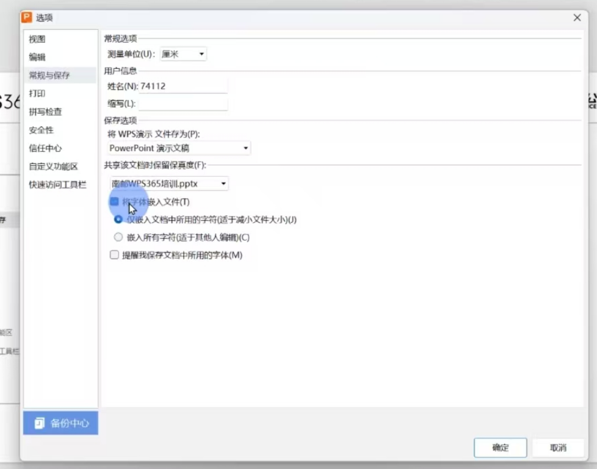
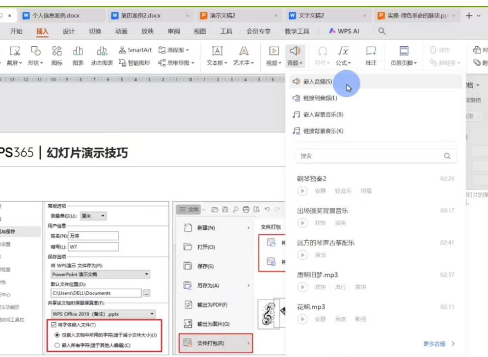

# PPT

## 结构

封面页,目录页,过渡页(每一章的首页),正文页,结束页

## 配色

## 模板与母版

> 母版有点类似与“背景”、
>
> 模板——从母版发展而来

操作:

0. 打开“幻灯片母版”+“模板形式”("插入占位符")

1. 如何总版有,而只有几个子板没有——几个子板选择"对象属性"+“隐藏背景图形”

2. 自定义配色: "设计"+"配色方案"+“自定义”

3. 文字美化: 

   a. 文字排版：选文本框的“**转智能图形**”

   b. 图片+文字: 文字的“对象属性”+“填充与轮廓”+“图片填充”

   c. 视频+文字：先点视频+\<C>+再点文字++“绘图工具”+“合并图形”

   d. 多图的等大线性排布:全选图片+“图片工具”+“对齐”+“等尺寸”

   e. 多图拼接

   f. 多图轮播

4. 打包: （字体+视频+音频）:

   

   

5. 嵌入: （字体）+(音乐)+(视频)

6. 

7. 

