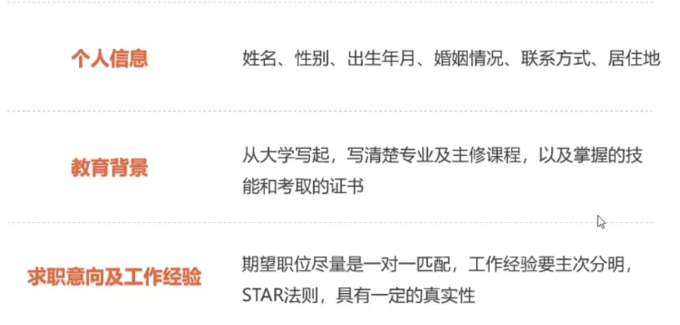

# 简历制作

## 简历的定义

1. 展示自己的文件
2. 谋求特定岗位
3. 展示个人信息,教育背景,求职意向

## 简历主要部分

封面页,简历页,自荐信

## 基本信息

## 常见结构

1. 从上到下
2. 左右分布

## 操作

> 操作是相似的,关键在于内容和版面设计

I.从上到下

1. 选取封面页
2. 页面窄边距
3. 弄表格（3*3）
4. 字体: 微软雅黑
5. **表格工具**:合并单元格——制作小标题
6. **表格样式**: 绘制表格——绘制变格线
7. **格式刷**:相同字体——快速制作字体
8. 布局选项:
9. **突出强调**：姓名和求职目标——微软雅黑 18 
10. 减弱大段文字的颜色——设置成灰色  黑色 文本1 浅色25%

10. 全选单元格: 
11. PPT绘制小标题的图标

II.左右分布

1. 利用“插入”+“形状”——绘制一些列图案
2. 页面窄边距

3. 图形化制作——**PPT**

## 介绍信

1. 名字于日期对齐——直接点击
2. 端头空两格——文档的段落布局

